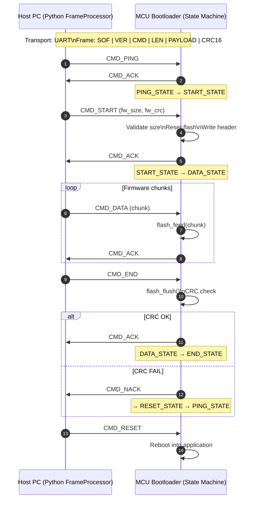

# STM32 Bootloader

> **Disclaimer**  
> This project is intended **for academic and educational purposes only**. It is **not production-ready** and must not be used in safety-critical or commercial products. The project currently lacks essential production features such as **firmware signing, secure boot, rollback protection, and cryptographic validation**.

This repository provides a minimal STM32 bootloader and demonstration application based on **STM32 HAL**, built using **CMake** and **gcc-arm-none-eabi**. It targets the **STM32F401RE** microcontroller and is intended to serve as an example of a minimal bootloader.

The project is currently scoped to the **STM32F401RE** only, but it can be adapted to other STM32 targets with minimal effort. When switching targets, updates to the `Drivers` directory may be required, as different devices rely on different HAL implementations.

---

## Dependencies

The following tools are required to build, flash, and debug the project:

- CMake ≥ 3.25  
- Ninja  
- gcc-arm-none-eabi  
- Python 3  
- pip  
- picocom  

---

## How to Build

1. Configure and build the project using:
   ```bash
   ./scripts/build_project.sh
   ```

2. Flash the bootloader:
   ```bash
   ./scripts/flash.sh
   ```

3. (Optional) Debug using GDB:

   - Start the OpenOCD server:
     ```bash
     openocd -f interface/stlink.cfg -f target/stm32f4x.cfg
     ```

   - Start the GDB client:
     ```bash
     gdb -ex "target remote localhost:3333" -ex "monitor reset halt" build/bootloader/cmake_stm32_bootloader.out
     ```
     or
     ```bash
     gdb -ex "target remote localhost:3333" -ex "monitor reset halt" build/app/cmake_stm32_app.out
     ```

   - Alternatively, you can launch GDB using the helper script:
     ```bash
     ./scripts/gdb.sh
     ```

4. (Optional – Highly Recommended) Open a serial terminal:
   ```bash
   picocom --imap lfcrlf -b 115200 /dev/ttyACM0
   ```

---

## Flashing the Application via Python Flasher

### 1. Enter DFU Mode

If the bootloader or demo application is currently running, press the **B1** button to reset the MCU into **DFU mode**. When DFU mode is active, you should see output similar to the following:

```bash
BOOTLOADER:    ____              __
BOOTLOADER:   / __ )____  ____  / /_
BOOTLOADER:  / __  / __ \/ __ \/ __/
BOOTLOADER: / /_/ / /_/ / /_/ / /_
BOOTLOADER: /_____/\____/\____/\__/
BOOTLOADER:
BOOTLOADER: Press Button to Enter DFU mode
BOOTLOADER: MAGIC NUMBER: 0xdeadbeef RESET_REASON: FIRMWARE UPDATE
BOOTLOADER: Entering in DFU ..
```

The bootloader will remain in DFU mode until it is either reset or a new firmware is flashed. If no valid application is found, the bootloader will automatically enter DFU mode.

---

### 2. Flash the Demo Application

1. Connect an **FTDI** adapter to **USART1**:
   - **PA9** → USART1_TX  
   - **PA10** → USART1_RX  

2. Run the Python flasher:
   ```bash
   python serial_protocol/python/serial_protocol.py \
     build/app/cmake_stm32_app.bin \
     --tty_port /dev/ttyUSB0 \
     --baudrate 115200
   ```

---

## Flash Layout
### Flash Memory Layout

The following table shows the flash memory usage in this demo. 32 KB are reserved for the bootloader, 512 B for the firmware header (containing CRC and length for verification), and 95.5 KB for the main application.

| Region        | Start Address | End Address   | Size        | Description          | Flash Sectors Used       |
|---------------|--------------|--------------|------------|--------------------|------------------------|
| Bootloader    | 0x08000000   | 0x08007FFF   | 32 KB      | MCU bootloader      | Sector 0, Sector 1      |
| FW Header     | 0x08008000   | 0x080081FF   | 512 B      | Firmware metadata   | Part of Sector 2        |
| Application   | 0x08008200   | 0x0807FFFF   | 95.5 KB | Main application  | Part of Sector 2, Sector 3 and 4 |


### Flash Sector Layout

The following table shows the flash memory layout by sector. Erase and write operations must occur per sector, handled in `bootloader/Src/flash_handler.c`

| Sector | Start Address | End Address   | Size   | Used By           | Usage Details                                |
|--------|--------------|--------------|--------|-----------------|---------------------------------------------|
| 0      | 0x08000000   | 0x08003FFF   | 16 KB  | Bootloader       | Entire sector used by bootloader            |
| 1      | 0x08004000   | 0x08007FFF   | 16 KB  | Bootloader       | Entire sector used by bootloader            |
| 2      | 0x08008000   | 0x0800BFFF   | 16 KB  | FW Header / App  | 0x08008000–0x080081FF: FW Header (512 B) <br> 0x08008200–0x0800BFFF: App (remainder) |
| 3      | 0x0800C000   | 0x0800FFFF   | 16 KB  | Application      | Entire sector used by application           |
| 4      | 0x08010000   | 0x0801FFFF   | 64 KB  | Application      | Entire sector used by application           |
| 5      | 0x08020000   | 0x0803FFFF   | 128 KB | Unused           | Free / reserved                              |
| 6      | 0x08040000   | 0x0805FFFF   | 128 KB | Unused           | Free / reserved                              |
| 7      | 0x08060000   | 0x0807FFFF   | 128 KB | Unused           | Free / reserved                              |

## Serial Protocol

The application firmware is programmed into the MCU by the bootloader over a UART connection using a custom serial protocol.
The following diagram illustrates the command exchange and bootloader state transitions during the firmware update process.



Each communication message is transmitted as a framed packet with the following format:

```
+--------+--------+--------+----------+----------+--------+--------+
| SOF    | VER    | CMD    | LEN      | PAYLOAD  | CRC_L  | CRC_H  |
+--------+--------+--------+----------+----------+--------+--------+
| 1 byte | 1 byte | 1 byte | 4 bytes  | N bytes  | 1 byte | 1 byte |
+--------+--------+--------+----------+----------+--------+--------+
SOF: 0xA5

VER: protocol version (starts at 0x01)

CMD: command ID

LEN: payload length (little-endian)

PAYLOAD: command-specific data

CRC: CRC16-CCITT (ccitt-false) calculated over: SOF | VER | CMD | LEN | PAYLOAD
```


## Notes

- This project is designed to be IDE-agnostic and script-driven.
- It is well suited for experimentation, learning, and academic exploration.
- Contributions and improvements are welcome.
