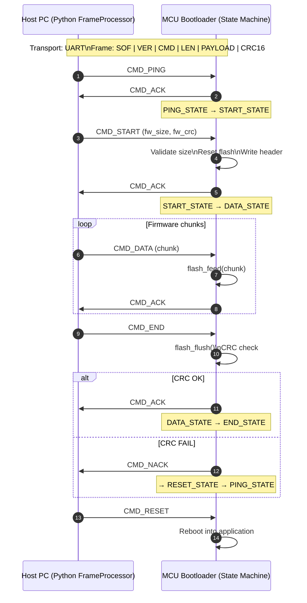

# STM32 Bootloader

> **Disclaimer**  
> This project is intended **for academic and educational purposes only**. It is **not production-ready** and must not be used in safety-critical or commercial products. The project currently lacks essential production features such as **firmware signing, secure boot, rollback protection, and cryptographic validation**.

This repository provides a minimal STM32 bootloader and demonstration application based on **STM32 HAL**, built using **CMake** and **gcc-arm-none-eabi**. It targets the **STM32F401RE** microcontroller and is intended to serve as an example of a minimal bootloader.

The project is currently scoped to the **STM32F401RE** only, but it can be adapted to other STM32 targets with minimal effort. When switching targets, updates to the `Drivers` directory may be required, as different devices rely on different HAL implementations.

---

## Dependencies

The following tools are required to build, flash, and debug the project:

- CMake ≥ 3.25  
- Ninja  
- gcc-arm-none-eabi  
- Python 3  
- pip  
- picocom  

---

## How to Build

1. Configure and build the project using:
   ```bash
   ./scripts/build_project.sh --toolchain path/to/arm-none-eabi/bin -b Debug
   ```

2. Flash the bootloader:
   ```bash
   ./scripts/flash.sh
   ```

3. (Optional) Debug using GDB:

   - Start the OpenOCD server:
     ```bash
     openocd -f interface/stlink.cfg -f target/stm32f4x.cfg
     ```

   - Start the GDB client:
     ```bash
     gdb -ex "target remote localhost:3333" -ex "monitor reset halt" build/bootloader/cmake_stm32_bootloader.out
     ```
     or
     ```bash
     gdb -ex "target remote localhost:3333" -ex "monitor reset halt" build/app/cmake_stm32_app.out
     ```

   - Alternatively, you can launch GDB using the helper script:
     ```bash
     ./scripts/gdb.sh
     ```

4. (Optional – Highly Recommended) Open a serial terminal:
   ```bash
   picocom --imap lfcrlf -b 115200 /dev/ttyACM0
   ```

---

## Flashing the Application via Python Flasher

### 1. Enter DFU Mode

If the bootloader or demo application is currently running, press the **B1** button to reset the MCU into **DFU mode**. When DFU mode is active, you should see output similar to the following:

```bash
BOOTLOADER:    ____              __
BOOTLOADER:   / __ )____  ____  / /_
BOOTLOADER:  / __  / __ \/ __ \/ __/
BOOTLOADER: / /_/ / /_/ / /_/ / /_
BOOTLOADER: /_____/\____/\____/\__/
BOOTLOADER:
BOOTLOADER: Press Button to Enter DFU mode
BOOTLOADER: MAGIC NUMBER: 0xdeadbeef RESET_REASON: FIRMWARE UPDATE
BOOTLOADER: Entering in DFU ..
```

The bootloader will remain in DFU mode until it is either reset or a new firmware is flashed. If no valid application is found, the bootloader will automatically enter DFU mode.

---

### 2. Flash the Demo Application

1. Connect an **FTDI** adapter to **USART1**:
   - **PA9** → USART1_TX  
   - **PA10** → USART1_RX  

2. Run the Python flasher:
   ```bash
   python serial_flasher/python/serial_flasher.py \
     build/app/cmake_stm32_app.bin \
     --tty_port /dev/ttyUSB0 \
     --baudrate 115200
   ```

---

## Flash Layout
### Flash Memory Layout

The following table shows the flash memory usage in this demo. 32 KB are reserved for the bootloader, 512 B for the firmware header (containing CRC and length for verification), and 95.5 KB for the main application.

| Region        | Start Address | End Address   | Size        | Description          | Flash Sectors Used       |
|---------------|--------------|--------------|------------|--------------------|------------------------|
| Bootloader    | 0x08000000   | 0x08007FFF   | 32 KB      | MCU bootloader      | Sector 0, Sector 1      |
| FW Header     | 0x08008000   | 0x080081FF   | 512 B      | Firmware metadata   | Part of Sector 2        |
| Application   | 0x08008200   | 0x0801FFFF   | 95.5 KB | Main application  | Part of Sector 2, Sector 3 and 4 |


### Flash Sector Layout

The following table shows the flash memory layout by sector. Erase and write operations must occur per sector, handled in `bootloader/Src/flash_handler.c`

| Sector | Start Address | End Address   | Size   | Used By           | Usage Details                                |
|--------|--------------|--------------|--------|-----------------|---------------------------------------------|
| 0      | 0x08000000   | 0x08003FFF   | 16 KB  | Bootloader       | Entire sector used by bootloader            |
| 1      | 0x08004000   | 0x08007FFF   | 16 KB  | Bootloader       | Entire sector used by bootloader            |
| 2      | 0x08008000   | 0x0800BFFF   | 16 KB  | FW Header / App  | 0x08008000–0x080081FF: FW Header (512 B) <br> 0x08008200–0x0800BFFF: App (remainder) |
| 3      | 0x0800C000   | 0x0800FFFF   | 16 KB  | Application      | Entire sector used by application           |
| 4      | 0x08010000   | 0x0801FFFF   | 64 KB  | Application      | Entire sector used by application           |
| 5      | 0x08020000   | 0x0803FFFF   | 128 KB | Unused           | Free / reserved                              |
| 6      | 0x08040000   | 0x0805FFFF   | 128 KB | Unused           | Free / reserved                              |
| 7      | 0x08060000   | 0x0807FFFF   | 128 KB | Unused           | Free / reserved                            
  |

The STM32F4 flash sectors are non-uniform: sectors 0–3 are 16 KB each, sector 4 is 64 KB, and sectors 5–7 are 128 KB. Erase is performed per sector, so erase cost grows with sector size.

### Firmware Header at 0x08008000

The "FW Header" row above refers to the runtime header consumed by the boot path: a 512 B `fw_header_t` (`boot_control/Inc/boot_config.h`) holding `magic` (`BOOT_INFO_MAGIC` / `0xDEADBEEF`), `fw_size`, and a CRC32. The bootloader writes it during the serial-flashing handshake (`fw_write_header` in `bootloader/Src/flash_handler.c`) and validates it on every boot via `fw_check_header`, which (1) checks the magic and (2) recomputes the CRC32 over the flashed firmware bytes (`fw_size` long, starting just after the header) and compares it against the stored value — a mismatch reroutes the next boot into DFU. The CRC32 is computed by the STM32F4 hardware CRC peripheral (`boot_control/Src/hw_crc.c`) — see [Hardware CRC32](#hardware-crc32) below.

### Hardware CRC32

Both firmware-image CRCs (the active `fw_header_t` and the in-progress `firmware_header_t`) are computed by the STM32F4 on-chip CRC peripheral via `hw_crc_calculate` in `boot_control/Src/hw_crc.c`. The unit is fixed-configuration on this MCU:

- Polynomial `0x04C11DB7`, init `0xFFFFFFFF`, no input/output reflection, no final XOR — i.e. **CRC-32/MPEG-2** (matches `crcmod`'s predefined `crc-32-mpeg`, **not** standard zlib CRC32).
- 32-bit-word input only. The implementation byte-swaps each word before feeding it so the unit consumes bytes in memory order, and zero-pads any trailing 1–3 bytes when the firmware length is not a multiple of 4. The Python host applies the same zero-padding before computing its CRC.

`hw_crc_init()` runs once on startup in `bootloader/Src/main.c`; `hw_crc_deinit()` resets and gates the peripheral right before `jump_to_application()` so the app starts with the CRC unit in a clean state.

The serial-frame CRC (transport-level, see [Serial Flasher](#serial-flasher) below) is a separate construct and remains a software CRC16-CCITT.

### Related: persistent state in RAM

Some bootloader/app interaction does not live in flash. The `bootloader_api_t` handoff (function pointers, reset reason, crash dump) sits in the `BOOT_CONFIG` noinit region at `0x20017C00`; see the [RAM Memory Layout](#ram-memory-layout) section.

## ARM Vector Table and Bootloader Jump
Below is a simplified representation of a Cortex-M vector table as stored in flash memory:

| Offset  | Vector Entry           | Description                                         |
|---------|-----------------------|-----------------------------------------------------|
| 0x00    | Initial MSP Value      | Initial value loaded into the Main Stack Pointer on reset |
| 0x04    | Reset Handler          | Entry point of the firmware, executed after reset  |
| 0x08    | NMI Handler            | Non-Maskable Interrupt handler                     |
| 0x0C    | HardFault Handler      | Hard fault exception handler                        |
| 0x10    | MemManage Handler      | Memory management fault handler                     |
| 0x14    | BusFault Handler       | Bus fault exception handler                          |
| 0x18    | UsageFault Handler     | Usage fault exception handler                        |
| 0x1C    | Reserved               | Reserved by ARM                                     |
| 0x20    | Reserved               | Reserved by ARM                                     |
| 0x24    | Reserved               | Reserved by ARM                                     |
| 0x28    | Reserved               | Reserved by ARM                                     |
| 0x2C    | SVCall Handler         | Supervisor call handler                             |
| 0x30    | Debug Monitor Handler  | Debug monitor exception handler                     |
| 0x34    | Reserved               | Reserved by ARM                                     |
| 0x38    | PendSV Handler         | PendSV exception handler                             |
| 0x3C    | SysTick Handler        | SysTick timer interrupt handler                     |
| 0x40+   | IRQn Handlers          | Peripheral interrupt handlers (IRQ0, IRQ1, ...)    |


Each entry is a 32-bit word containing either an initial value or a function pointer to an exception or interrupt handler.

On ARM Cortex-M microcontrollers, the vector table is a fixed data structure located at the beginning of the firmware image. It contains the initial execution context and the addresses of all exception and interrupt handlers.

The first two entries of the vector table are critical:

1. Initial Stack Pointer (MSP) – Loaded automatically into the Main Stack Pointer on reset.

2. Reset Handler Address – The entry point of the firmware, executed immediately after reset.

Subsequent entries contain the addresses of fault handlers, system exceptions, and peripheral interrupt service routines (ISRs).

By default, the vector table is expected at address 0x08000000, but Cortex-M devices allow relocating it using the VTOR (Vector Table Offset Register).

### Boot Decision Tree

Before any jump happens, the bootloader (`bootloader/Src/main.c`) runs a small decision tree on every reset:

1. `HAL_Init()` → `init_boot_api()` → print banner.
2. Read the persisted reset reason from `bootloader_api_ptr->boot_info`:
   - **`HARD_FAULT`** → call `crash_dump_print()` to dump the captured fault state over UART, then halt in an infinite loop. The user must power-cycle to continue. (See the [Stack Diagnostics and Crash Dump](#stack-diagnostics-and-crash-dump) section.)
   - **`FIRMWARE_UPDATE`** → enter DFU directly (no countdown).
   - **Anything else** → 3 × 1 s countdown (`try_enter_DFU_mode()`), polling the **B1 button on PC13** (configured falling-edge in `MX_GPIO_Init`); if pressed at any point, enter DFU.
3. If DFU was entered: switch the persisted reason to `APPLICATION_RESET` (so a debugger-driven soft reset doesn't loop back into DFU), run `recv_firmware()` over UART1 with `serial_api_t` wired to the flash handler, then `bootloader_api_ptr->reset(APPLICATION_RESET)`.
4. If DFU was not entered: `fw_check_header()` validates the 512 B `fw_header_t` (magic + hardware CRC32 over the firmware bytes). On mismatch the bootloader resets with reason `FIRMWARE_UPDATE`, which sends the next boot straight back into DFU.
5. On success: call `bootloader_api_ptr->jump_to_application()`.

Note: the bootloader does **not** call `init_stack()` / `print_stack_info()` — those are app-side only (`app/Src/main.c`). The stack-painting sentinel never gets written into the bootloader's stack region.

### Bootloader to Application Jump

In this project, the bootloader resides at the beginning of flash and the application is located at a higher address (0x08008200). The actual jump is implemented in `boot_control/Src/boot_config.c` (`jump_to_address` + `deinit_peripherals`). The full sequence:

1. Read the application's initial MSP and reset-handler addresses from the first two words of its vector table at `APP_START_ADDR`.
2. **Sanity-check the MSP**: the value must match the `0x2000xxxx` RAM prefix. A bad value is treated as "no application loaded" and the function returns instead of jumping.
3. `__disable_irq()` to mask interrupts during teardown.
4. **Deinit peripherals** (`deinit_peripherals()`):
   - Stop SysTick: `CTRL = 0`, `LOAD = 0`, `VAL = 0`, then `NVIC_ClearPendingIRQ(SysTick_IRQn)`.
   - For all 8 NVIC banks: `ICER[i] = 0xFFFFFFFF` (disable IRQs) and `ICPR[i] = 0xFFFFFFFF` (clear pending).
   - `__DSB(); __ISB();` to ensure the disables take effect before continuing.
   - `HAL_RCC_DeInit()` to restore default clock config.
   - Clear pending SysTick (`SCB->ICSR |= SCB_ICSR_PENDSTCLR_Msk`) and all System Handler fault enables (`SCB->SHCSR = 0`).
5. `HAL_DeInit()` to release any remaining HAL state.
6. Relocate the vector table: `SCB->VTOR = APP_START_ADDR;`.
7. Load the application's MSP: `__set_MSP(app_stack);`.
8. `__enable_irq()` immediately before the jump so the application starts with interrupts enabled.
9. Jump to the application's reset handler as a function pointer:
    ```c
    ((void (*)(void)) app_reset_handler)();   // does not return
    ```

After this sequence, execution continues entirely within the application as if it had been started directly after reset.

### Bootloader API Handoff

The bootloader exposes a small API to the application via `bootloader_api_ptr`, a pointer to a `bootloader_api_t` placed in the `BOOT_CONFIG` noinit RAM region (fixed at `0x20017C00`). This is what gives the app a controlled way to reboot back into the bootloader. The struct (see `boot_control/Inc/boot_config.h`) holds:

- `jump_to_application` — function pointer the bootloader uses to launch the app; not normally invoked by the app.
- `reset(reset_reason_e)` — the app calls this to trigger a system reset while annotating *why*. The implementation stamps `BOOT_INFO_MAGIC` and the reason into the noinit struct, then calls `NVIC_SystemReset()`. The next bootloader run reads the reason and routes accordingly (e.g. `FIRMWARE_UPDATE` lands directly in DFU, `HARD_FAULT` triggers the crash dump path).
- `boot_info` — `magic`, `reset_reason_uint`, and the persisted `crash_dump_t`.

Because this struct lives in noinit RAM, the bootloader and app share state across warm resets without touching flash.


## Serial Flasher

The application firmware is programmed into the MCU by the bootloader over a UART connection using a custom serial protocol.
The following diagram illustrates the command exchange and bootloader state transitions during the firmware update process.


```mermaid
sequenceDiagram
    autonumber
    participant Host as Host PC (Python FrameProcessor)
    participant MCU as MCU Bootloader (State Machine)

    Note over Host,MCU: Transport: UART\nFrame: SOF | VER | CMD | LEN | PAYLOAD | CRC16

    %% --- PING ---
    Host->>MCU: CMD_PING
    MCU->>Host: CMD_ACK
    Note over MCU: PING_STATE → START_STATE

    %% --- START ---
    Host->>MCU: CMD_START (fw_size, fw_crc)
    MCU->>MCU: Validate size\nReset flash\nWrite header
    MCU->>Host: CMD_ACK
    Note over MCU: START_STATE → DATA_STATE

    %% --- DATA LOOP ---
    loop Firmware chunks
        Host->>MCU: CMD_DATA (chunk)
        MCU->>MCU: flash_feed(chunk)
        MCU->>Host: CMD_ACK
    end

    %% --- END ---
    Host->>MCU: CMD_END
    MCU->>MCU: flash_flush()\nCRC check
    alt CRC OK
        MCU->>Host: CMD_ACK
        Note over MCU: DATA_STATE → END_STATE
    else CRC FAIL
        MCU->>Host: CMD_NACK
        Note over MCU: → RESET_STATE → PING_STATE
    end

    %% --- RESET ---
    Host->>MCU: CMD_RESET
    MCU->>MCU: Reboot into application

```

Each communication message is transmitted as a framed packet with the following format:

```
+--------+--------+--------+----------+----------+--------+--------+
| SOF    | VER    | CMD    | LEN      | PAYLOAD  | CRC_L  | CRC_H  |
+--------+--------+--------+----------+----------+--------+--------+
| 1 byte | 1 byte | 1 byte | 4 bytes  | N bytes  | 1 byte | 1 byte |
+--------+--------+--------+----------+----------+--------+--------+
SOF: 0xA5

VER: protocol version (starts at 0x01)

CMD: command ID

LEN: payload length (little-endian)

PAYLOAD: command-specific data

CRC: CRC16-CCITT (ccitt-false) calculated over: SOF | VER | CMD | LEN | PAYLOAD
```

### Command IDs

| Name        | Value  | Direction      | Payload                                         |
|-------------|--------|----------------|-------------------------------------------------|
| `CMD_PING`  | `0x01` | Host → MCU     | none                                            |
| `CMD_START` | `0x02` | Host → MCU     | `uint32_t fw_size` (LE) + `uint32_t fw_crc` (LE, CRC-32/MPEG-2 over zero-padded firmware) — 8 bytes |
| `CMD_DATA`  | `0x03` | Host → MCU     | firmware chunk bytes                            |
| `CMD_END`   | `0x04` | Host → MCU     | none                                            |
| `CMD_RESET` | `0x05` | Host → MCU     | none                                            |
| `CMD_ACK`   | `0x7F` | MCU → Host     | none (`LEN = 0`)                                |
| `CMD_NACK`  | `0x7E` | MCU → Host     | none (`LEN = 0`)                                |

### Frame Sizing and Timeouts

- **Maximum payload size: 2039 bytes.** Derived from `BUFFER_MAX_SIZE − HEADER_SIZE − CRC_SIZE = 2048 − 7 − 2`. `CMD_DATA` chunks must fit within this.
- **Default host chunk size: 1024 bytes** (`serial_flasher/python/serial_flasher.py`); configurable via the `FrameProcessor` constructor.
- **Per-frame UART receive timeout: 100 ms** (`TIMEOUT_MS` in the MCU FSM). A frame that does not complete within the window is treated as a frame error.

### MCU State Machine and Error Handling

The Mermaid diagram above shows the happy path. The full error semantics:

| State         | Frame error / bad CRC / unexpected CMD                      | CRC mismatch on `CMD_END`            |
|---------------|-------------------------------------------------------------|--------------------------------------|
| `PING_STATE`  | NACK, **stay** in `PING_STATE`                              | n/a                                  |
| `START_STATE` | NACK, transition to `RESET_STATE` → `PING_STATE`            | n/a                                  |
| `DATA_STATE`  | NACK, transition to `RESET_STATE` → `PING_STATE`            | NACK, `RESET_STATE` → `PING_STATE`   |

`RESET_STATE` always falls through to `PING_STATE`, so any hard error forces the host to start over from `CMD_PING`. There is no retry cap on either side; the Python flasher raises `RuntimeError` on the first NACK or frame error and stops.

`CMD_ACK` and `CMD_NACK` frames have empty payloads (`LEN = 0`) — they are 9-byte fixed-length frames (`SOF | VER | CMD | LEN(=0) | CRC_L | CRC_H`).

### Transport / Flash Injection

The protocol FSM lives in `serial_flasher/mcu/Src/serial_flasher.c` and is transport- and flash-agnostic. The bootloader wires it up at runtime via `set_serial_api(serial_api_t)` (`bootloader/Src/main.c`), passing in:

| Field              | Implementation                                  |
|--------------------|-------------------------------------------------|
| `send`             | `uart1_send`                                    |
| `recv`             | `uart1_recv`                                    |
| `fw_feed`          | `flash_fw_feed`                                 |
| `fw_flush`         | `flash_fw_flush`                                |
| `fw_reset`         | `flash_fw_reset`                                |
| `fw_crc_check`     | `fw_crc_check`                                  |
| `fw_write_header`  | `fw_write_header`                               |
| `max_fw_size`      | `get_max_fw_size()`                             |

This is the seam to swap if you want to drive the same FSM over a different transport (USB CDC, SPI) or against a different flash backend.

## Stack Diagnostics and Crash Dump

The `boot_control` module provides runtime stack-usage analysis and a persistent crash-dump path that survives a HardFault-triggered reset.

### Stack Painting and High-Water Mark

At reset, `init_stack()` paints the unused portion of the stack with the sentinel word `0xDEADBEEF`, from `_sstack` up to a safe headroom below the live MSP. The worst-case usage can then be derived at any time by scanning upward from `_sstack` and counting words that still hold the sentinel — the first non-sentinel word marks the deepest point the SP ever reached.

Public API (see `boot_control/Inc/stack_config.h`):

| Function | Purpose |
|---|---|
| `init_stack()` | Paint the stack with `0xDEADBEEF`. Called early from the Reset_Handler before `.data`/`.bss` init. |
| `get_stack_size()` | Total stack region size in bytes (`_estack - _sstack`). |
| `get_stack_high_water()` | Worst-case bytes ever used since `init_stack()`. A value equal to `get_stack_size()` indicates overflow. |
| `print_stack_info()` | Prints `base / top / size / high_water (P%)` over UART. |
| `print_heap_info()` | Prints heap base/top, max-available, and reserved heap size. |
| `traverse_stack()` | Snapshots the stack into a static buffer (sized by `STACK_USAGE_BYTES`, currently 0x1000) and prints it word by word, so the dump itself does not contaminate the live region. |
| `traverse_stack_skip_words(offset_words)` | Same dump, but starts `offset_words` words above `_sstack`. Useful when only the top frames are interesting. |

The snapshot-then-print pattern matters: printf uses stack scratch space, so reading the live stack directly while printing would corrupt the bottom of the region you are trying to inspect.

### HardFault Crash Dump

When a HardFault fires, the assembly `HardFault_Handler` selects the faulting stack pointer (MSP or PSP via `EXC_RETURN`) and tail-calls into `hardfault_c(uint32_t* fault_sp)`. That C handler captures CPU state into a `crash_dump_t` stored in the `BOOT_CONFIG` noinit RAM section, then resets the system with reason `HARD_FAULT`.

`crash_dump_t` (see `boot_control/Inc/boot_config.h`) holds:

- `sp_at_fault` — stack pointer at fault entry
- `cfsr`, `hfsr`, `mmfar`, `bfar` — fault status registers
- `hw_frame[8]` — the hardware-stacked exception frame (`r0-r3, r12, lr, pc, xPSR`)
- `stack_captured` and `stack[CRASH_DUMP_STACK_WORDS]` — words copied starting from `sp_at_fault`

On the next boot, the bootloader detects `reset_reason == HARD_FAULT` and calls `crash_dump_print()` to emit the dump over UART. The output is bracketed by `=== CRASH DUMP BEGIN ===` and `=== CRASH DUMP END ===` markers so a captured serial log can be sliced cleanly into a file for the offline decoder.

### Triggering a Crash (demo)

The demo application provides an interactive way to provoke a crash without touching code. After the bootloader hands off to the app:

1. The app prints `STARTING STACK RECURSION: WILL PURPOSELY CRASH IF B1 IS PRESSED` and waits 5 s.
2. It enters `print_recursion(128)`, which exercises the stack on the way down.
3. If **B1 is pressed at any point during the recursion**, the EXTI callback sets `reset_called`; the next recursion frame prints a 3 s "CRASHING IN ..." countdown and executes `udf #0` to raise a HardFault.
4. The fault path captures the dump, resets, and the bootloader prints it on the next boot.

To leave the app running normally, simply do not press B1 during the 5 s window or the recursion phase — recursion completes, the app loops in the blink/idle state, and B1 from there triggers a clean `APPLICATION_RESET` rather than a crash.

### Offline Decode

Raw register values and stack words are not very actionable on their own. `scripts/decode_crash.py` consumes the textual dump (from `--dump <file>` or stdin) and an ELF, and produces a readable backtrace:

- Decodes `CFSR` / `HFSR` flag bits into names.
- Resolves `pc` and `lr` to function and `source:line` via `addr2line` (C++ demangled).
- Walks the captured stack for return-address candidates (`0x0800xxxx`) and validates each by checking that the instruction at `addr - 4` in the ELF is `bl` / `blx`, marking frames as confirmed or unconfirmed.
- For frames present in DWARF, prints the parameter list. For the faulting frame, the first four params are mapped to `r0-r3` from `hw_frame`.

Requires `pyelftools` (`pip install -r requirements.txt`).

```bash
python scripts/decode_crash.py \
  --elf build/app/cmake_stm32_app.out \
  --addr2line /opt/arm-gnu-toolchain-14.3.rel1-x86_64-arm-none-eabi/bin/arm-none-eabi-addr2line \
  --objdump   /opt/arm-gnu-toolchain-14.3.rel1-x86_64-arm-none-eabi/bin/arm-none-eabi-objdump \
  --dump      crash_dump_example
```

## RAM Memory Layout

The STM32F401RE has 96 KB of SRAM mapped at `0x20000000`. The linker (`app/stm32f401_app.ld`) splits it into two regions: a 95 KB working `RAM` region and a 1 KB `RAM_CFG` region at the top, reserved for state that must survive a warm reset.

| Region    | Start        | End          | Size  | Contents                                                |
|-----------|--------------|--------------|-------|---------------------------------------------------------|
| `RAM`     | `0x20000000` | `0x20017BFF` | 95 KB | `.data`, `.bss`, heap, stack                            |
| `RAM_CFG` | `0x20017C00` | `0x20017FFF` | 1 KB  | `.BOOT_CONFIG` noinit section (`bootloader_api_t`)      |

Inside the working `RAM`:

```
0x20000000  +-----------------------------+
            | .data       (initialized)   |  copied from FLASH at startup
            +-----------------------------+
            | .bss        (zero-init)     |  cleared at startup
            +-----------------------------+  _sheap / end / _end
            | .heap                       |  >= _Min_Heap_Size (0x200)
            |   |                         |  used by newlib _sbrk
            |   v  grows toward higher    |
            +-----------------------------+  _eheap (reserved heap ceiling)
            |  ... free gap ...           |  available to heap until it
            |                             |  hits _sstack
0x20016C00  +-----------------------------+  _sstack
            |   ^  grows toward lower     |
            |   |                         |  _Stack_Size = 0x1000 (4 KB)
            | stack                       |
0x20017C00  +-----------------------------+  _estack (top of RAM)
            | .BOOT_CONFIG (noinit)       |  RAM_CFG region, survives reset
0x20018000  +-----------------------------+
```

Key points:

- **Stack is anchored to the top of `RAM`**, not just placed after the heap. `_estack` = `ORIGIN(RAM) + LENGTH(RAM)` = `0x20017C00`, and `_sstack` = `_estack - _Stack_Size`. This makes the stack location deterministic regardless of how `.bss` or the heap grow.
- **Heap and stack share the gap between `_eheap` and `_sstack`.** The heap can grow past `_eheap` (its reserved minimum) up to `_sstack`. The linker enforces `ASSERT(_eheap <= _sstack)` so a build that cannot guarantee `_Min_Heap_Size` fails loudly. Run-time collisions are still possible if the heap grows past the stack floor — `print_heap_info()` reports both the reserved size and the absolute upper bound.
- **`RAM_CFG` is a separate noinit region**, not just an ordinary section. The `.noinit` output section places `*(.BOOT_CONFIG)` in `RAM_CFG` with `NOLOAD`, so startup code never zeroes it. This is what lets `crash_dump_t` and the rest of `bootloader_api_t` persist across the warm reset triggered by `hardfault_c()`. The boot info is validated on the next boot via the magic field (`BOOT_INFO_MAGIC = 0xDEADBEEF`).
- **Stack painting (`0xDEADBEEF`) only touches the working `RAM` stack region**, never `RAM_CFG`. The two regions are physically adjacent but logically independent.

## Notes

- This project is designed to be IDE-agnostic and script-driven.
- It is well suited for experimentation, learning, and academic exploration.
- Contributions and improvements are welcome.
